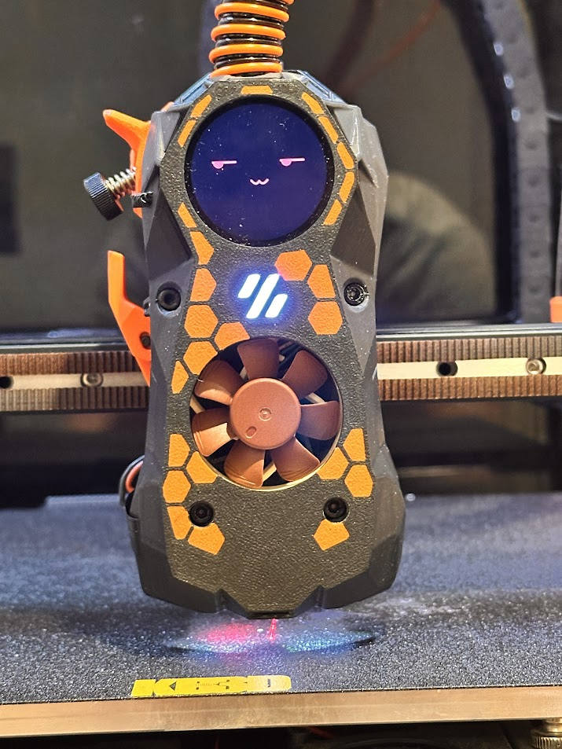
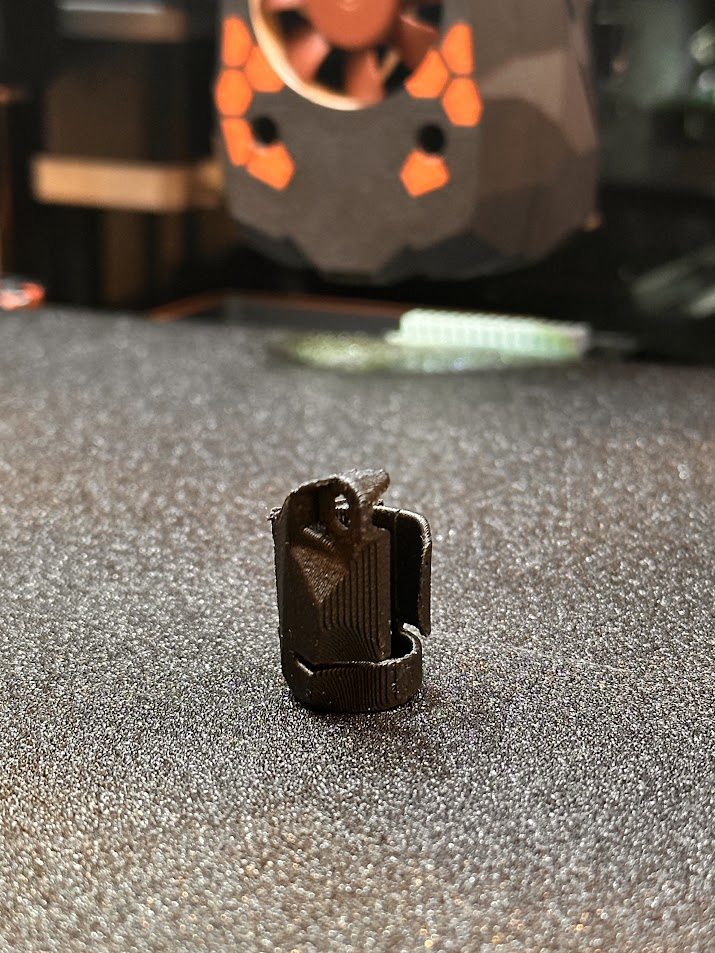
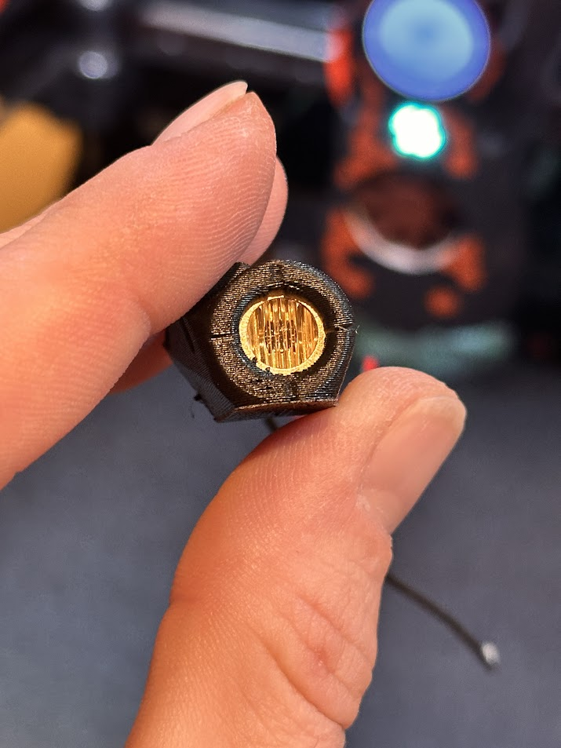
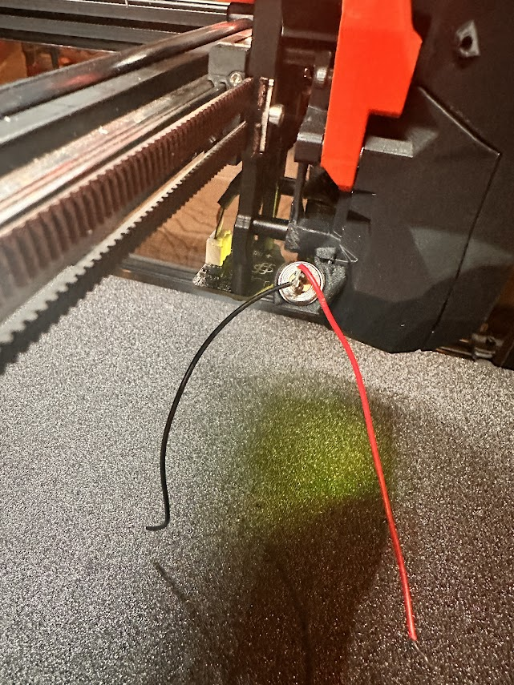
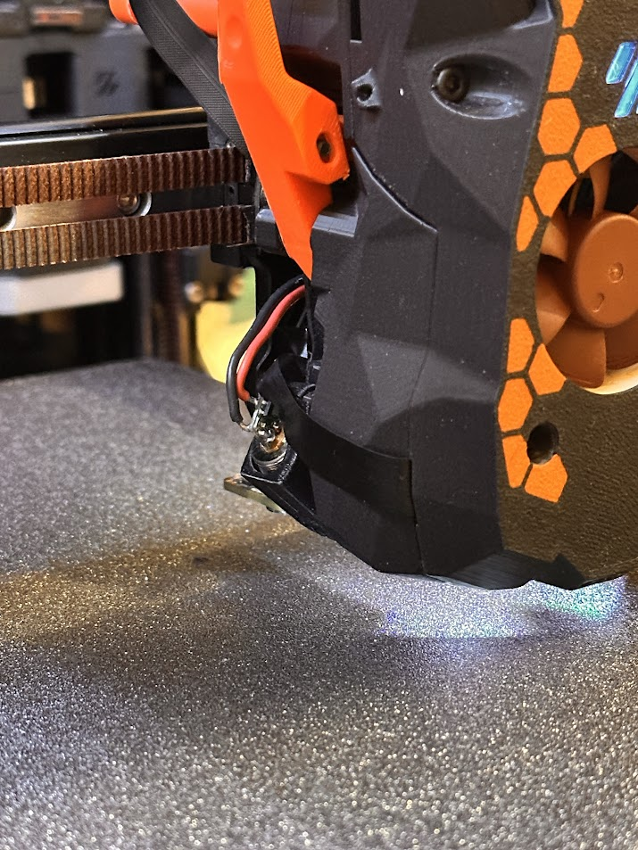
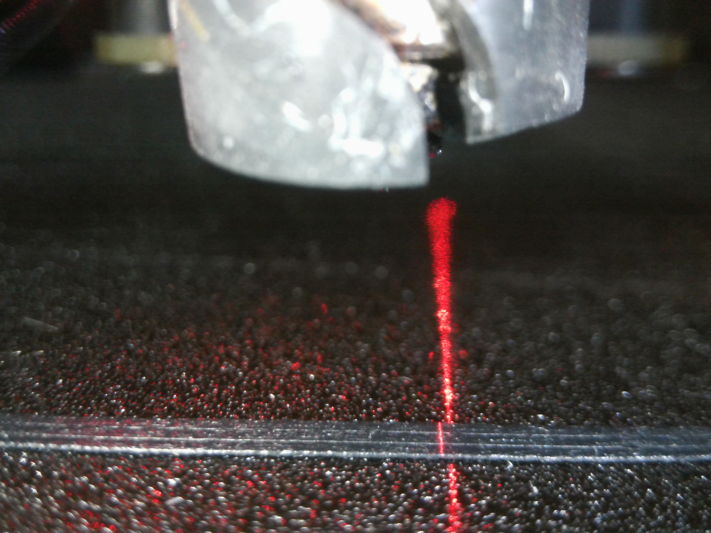

# Rubedo - Tedshrop Fork
## A tool for automatically calibrating pressure advance at runtime.
This tool is an elaboration on the work done by furrysalamander. The original version can be found [here](https://github.com/furrysalamander/rubedo).

Most of the code is still original, most of the rest of this readme is still original. I will be updating it as I expand the functionality and then rewrite this whole section.

I've modified the code to expose additional variables that can be set both in the constants.py file, and at runtime through gcode macro arguments.

I've also modified the setup to use the existing 3do nozzle cam, and mount the laser behind the stealthburner out of the way (unless you have a blobifier).


*The system installed on my printer*


*On the left is the pattern that was scanned. The middle pattern shows the pattern printed with pressure advance disabled, and the pattern on the right shows a pattern printed with the calibrated value.*

***
### Disclaimer
This tool is still very much experimental. I hope that someday it will grow to be more robust and user friendly, but right now you should know at least a little bit of Python if you're interested in trying it out. It's not perfect. The gcode that is generated may not play nicely with your printer. I would recommend keeping the emergency stop button within close reach the first time you run the calibration, just to be safe.
***

## Things you will need to setup on your printer:
* A Stealthburner (for now). It could be adapted to any system that has a nozzle camera.
* A high quality USB camera. I use the 4K 3DO nozzle camera in the default Stealthburner location.
* An adjustable focus line laser. I tested a fixed focus laser earlier on, but the beam was super thick and there was no way to adjust it. I have a laser like [this](https://www.amazon.ca/gp/product/B07L428BDG/ref=ppx_yo_dt_b_search_asin_image?ie=UTF8&th=1). 
* The laser mounted on the toolhead. I am using the mount `Laser Mount V4.stl` located in the `camera_mounts` directory. Please note: My setup is for the UHF variant of the Stealthburner, and I haven't made a mount for the regular sized SB yet. If you modify it or make one for your application, please let me know if I can post it back here for others. If you're using the Blobifier, you'll need to reprint your shaker. You can find one that will clear the laser in `camera_mounts`.

***
## HARDWARE INSTALLATION

Here's the process to get the laser installed:

* Step 0 - Print the mount
* Step 1 - Flip it up on it's face and heat your bed 
 

* Step 2 - When the print is hot, insert the laser module with the lens oriented as shown below
 

* Step 3 - Remove the cylindrical cover of the laser module, then replace and resolder the wires (they're dinky) and install it on the back of the Stealthburner.
 

* Step 4 - Focus your laser:  Turn your printer on, move it to ~8mm from the bed and look through your nozzle camera. Power the laser with a 2.5-5V source (coin cell batter works well). Rotate the laser within the lens body in order to focus it perfectly to the bed.
* Step 5 - Route your wires to any 5v fan output. It's possible to use a 12v or 24v output if you put the appropriate resistor in series. If you're not familiar with that, do a google search for LED resistor calculator.
 


## SOFTWARE INSTALLATION

* Install a few  dependencies:
    ```
    sudo apt install ffmpeg python3-opencv python3-matplotlib python3-aiohttp python3-websocket
    cd ~
    git clone https://github.com/tedshrop/rubedo.git
    ```
* copy rubedo_macros.cfg to your printer configuration folder and put the following at the top of your printer.cfg. Go through and set the PIN# for the laser as you have it installed on your machine.
    ```
    [include rubedo_macros.cfg]
    ```
* Do a firmware restart. You should now be able to test your laser by using the LASER_ON and LASER_OFF macros.
* Turn your laser on and open the camera image on mainsail/fluidd. Slide a piece of first-laser filament into view (like a purge line or brim) roughly 3mm in front of the nozzle, or wherever it's perfectly in focus. On your browser, right click the camera image and save it. Open in microsoft paint or any other image editing software to determine what the crop should be. In my image for example, the crop was 250px by 250px, starting from 1500,1500.
 

* Go through the `constants.py` file, and adjust whatever you need to in order to set the defaults the way you like. This can always be changed later at runtime.


# Code Organization
The code that allows for hands free calibration is in `main.py`. Once you've configured everything correctly, you should be able to run the script and get recommended pressure advance value.  If you have `VALIDATE_RESULTS` enabled, the printer will print another two patterns, one w/ PA disabled, and another with the selected value. Most users probably won't want this, so feel free to turn it off.  It also makes it hard to find the recommended value in the scripts output.

If you want to test a different range of pressure advance values, or change where the calibration pattern is printed, you can do so by editing the parameters used for the PatternInfo object created at the start of the main function. By default, the pattern is printed at (30, 30), and tests 10 PA values between 0 and 0.06.

### `pa.py`
This file contains code for generating the calibration pattern gcode.

### `record.py`
This file contains functions for recording video clips of the printed lines.

### `processing.py`
This file contains a few utilities that filter and transform the video frames to help minimize noise.

### `analysis.py`
This file contains the code that generates height maps for each line, and then computes the line deviation for each heightmap.

### `visualization.py`
This file contains several utilities for visualizing the height maps and data that is generated from the scans. Currently, some of the functions here are in disrepair, as I needed the output during early development, but haven't used them since.

### `generate_bulk_scans.py`
This file will print 27 copies of the calibration pattern, scan all of them, and then save the results for later analysis. I used this while working on my research paper for this project to measure how consistent the system was.

### `generate_report_data.py`
This script consumes the files generated by the `generate_bulk_scans.py` script, and generates height map visualizations for each line that was scanned. In addition, it generates charts that aggregate the data from all scans to visualize the overal consistency of the calibration process.

